# How To upload Files on GitHub (using VSCode)

Table of contents
=================

* [How To upload Files on GitHub (using VSCode)](#how-to-upload-files-on-github-using-vscode)
* [Prerequisites](#prerequisites)
* [1. Setting USER](#1-setting-user)
* [2. Open folder in VSCode](#2-open-folder-in-vscode)
* [3. Publishing to GitHub](#3-publishing-to-github)
* [4. Adding new changes or new file](#4-adding-new-changes-or-new-file)
* [5. Want to delete a file](#5-want-to-delete-a-file)
* [6. How to view my Repository](#6-how-to-view-my-repository)

---
## Prerequisites:

    VsCode and Git must be installed on your Computer.

<a href = "https://git-scm.com/downloads" target= "_blank"> Download Git </a>

<a href="https://code.visualstudio.com/download" target="_blank"> Download VSCode </a>

---

NOTE: 
    
    while doing this tutorial, if VSCode ask for sign in, then simply sign in with your GitHub account and give all permissions
    
    rest of the steps will be same

---
## 1. Setting USER 

    1. Search for `git bash` in your PC and open it

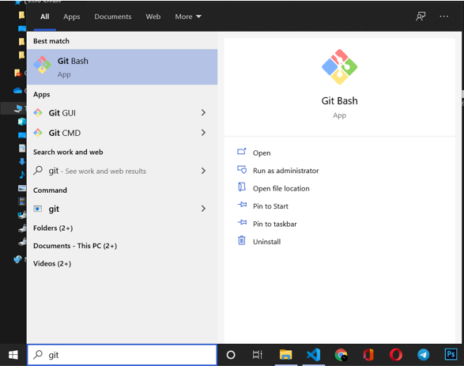

    2. Now git bash terminal is open.
    3. Now type the following command in the terminal.

command to set user name

    git config --global user.name "Your User Name"
Eg : `git config --global user.name sailesh307`

command to set user email

    git config --global user.email "Your Email"
Eq : `git config --global user.email sailesh953@gmail.com`

It will look like this.

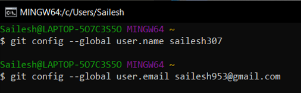

Now you can close the terminal.

[Note: This is one time process only. So, we don't need to do this again and again. Just do it once and you are good to go.]

---
## 2. Open folder in VSCode

    1. Open VsCode
    2. Select file > Open Folder

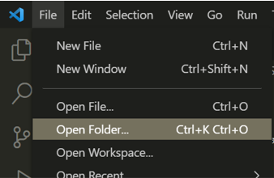

    3. now select your Folder that you want to upload.

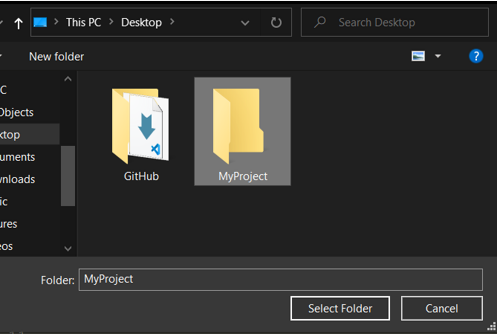

---
## 3. Publishing to Github

    1. Select Source Control Option

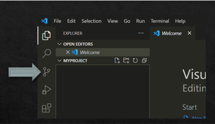

    2. Now click on Publish to GitHub

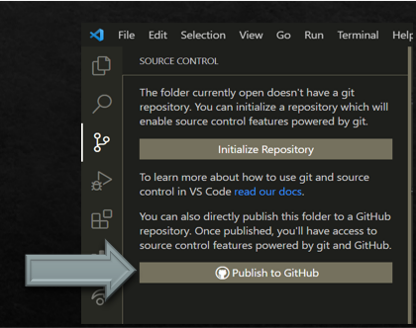

    3. Select option for private or public repository

    private => only you can see the repository

    public => anyone can see the repository

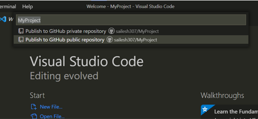

    4. Now uncheck the checkbox of those file that you don't want to upload

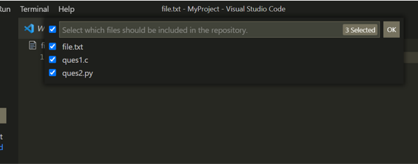

    I don't want to upload file.txt file so I am unchecking it.

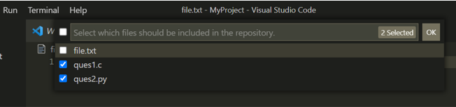

    5. then press OK

    Now it will start uploading your files to your GitHub repository.

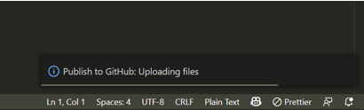

    after few second Upload will complete.

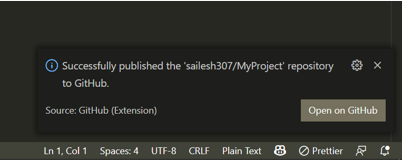

    Now click on Open on GitHub to view the repository.

    Now repo will be opened in your browser.

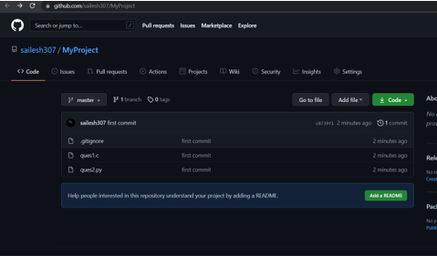

    Now in your Vscode you will see a new file named as .gitignore.
    this file will contain all the files that will not upload to github.
    you can add any file that you want to ignore.

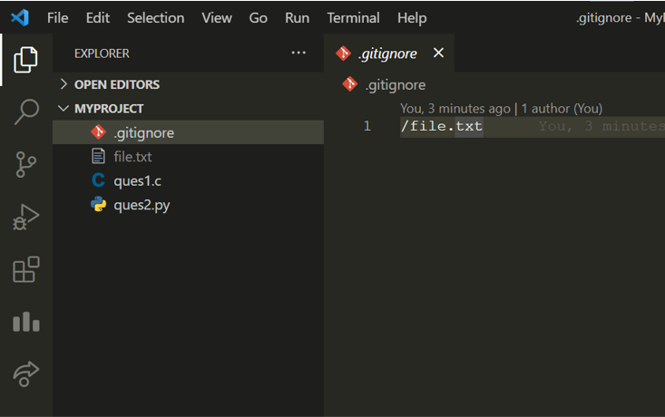

---
## 4. Adding new changes or new file

    i have added a new file in my repository named newProgram.c
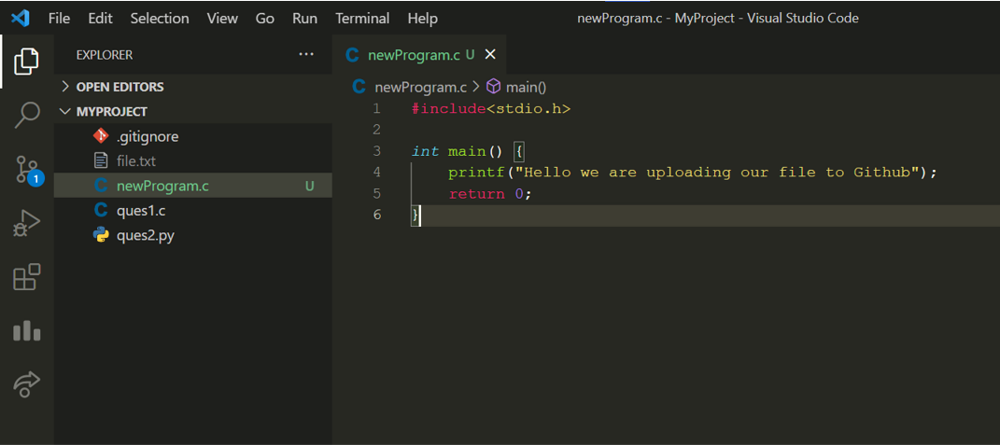

    Now click on Source control button.
    this will show all the changes that i have made in my repository.

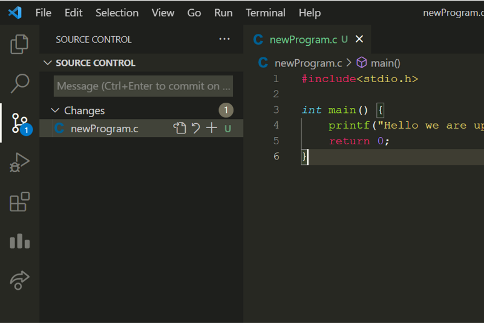

    now write commit message(type anything you want) and click on commit changes(the tick option).

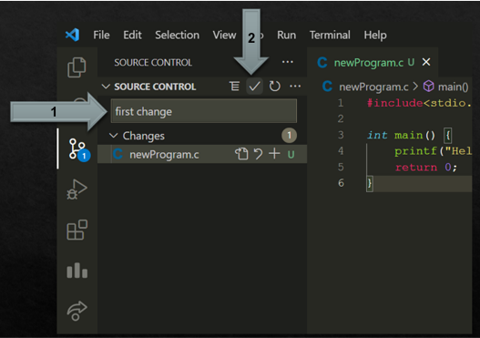

    Now click on Yes

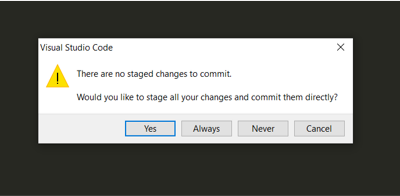

    Now click on three dot and click on push option.

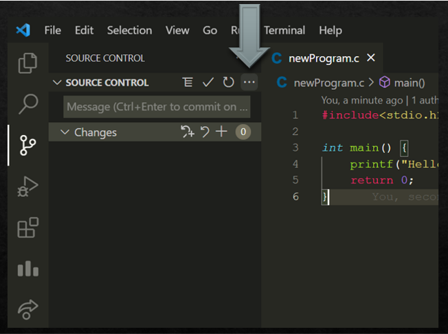

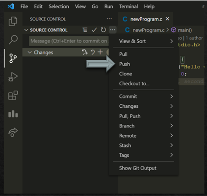

    Now open your browser.

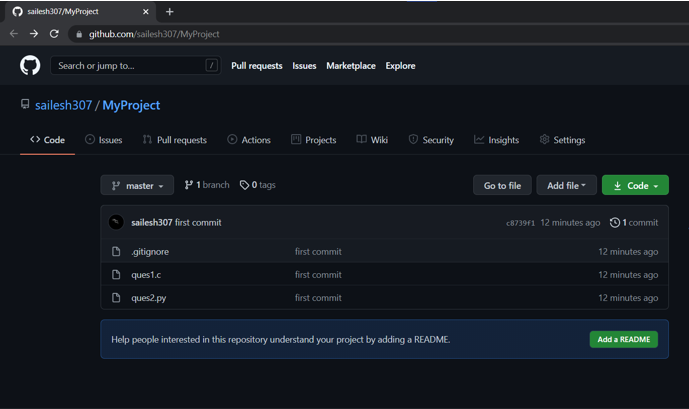

    Now Referesh the page to view all new file/ changes you have made.

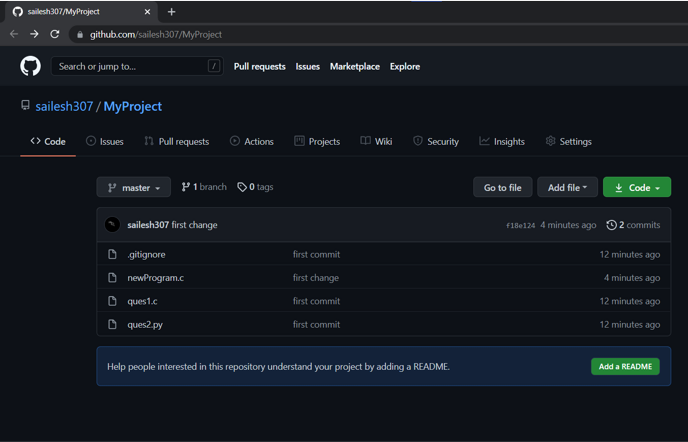

    now all new changes are updated in your repository.

    if in future you want to add new commit then you can do it by repeating this step again.

    [Note : new commit means new changes in your repository]

[want to add more changes](#4-adding-new-changes-or-new-file)

---
## 5. Want to delete a file
    
    simply delete the file in your VSCode and follow step 4. (as this is a change)
[Step 4](#4-adding-new-changes-or-new-file)

---
## 6. How to view my Repository

    1. open your gitHub account

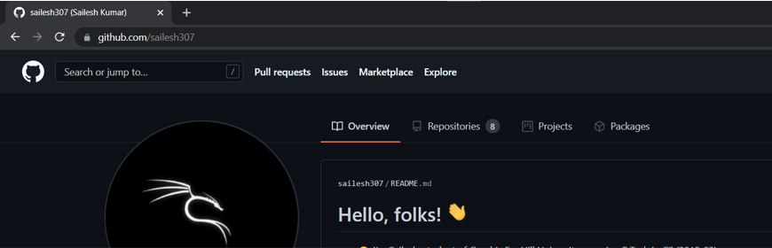

    2. Now click on Repositories

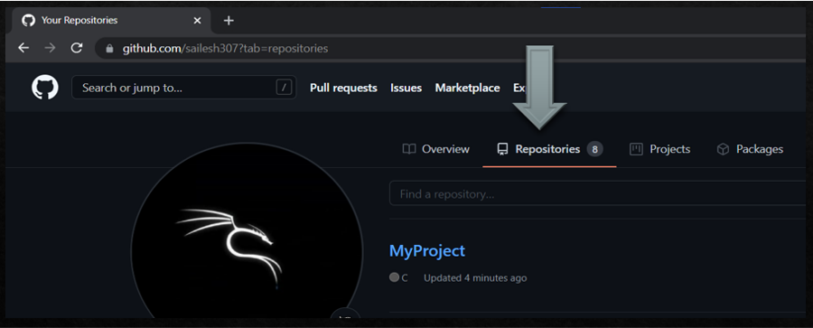

    3. Now click on your repository that you want to view.

---
# THANK YOU for reading this tutorial.
